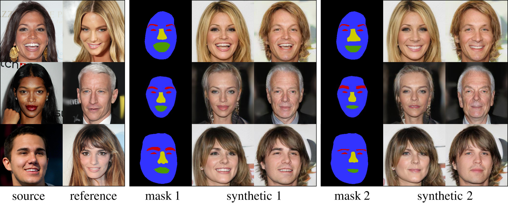
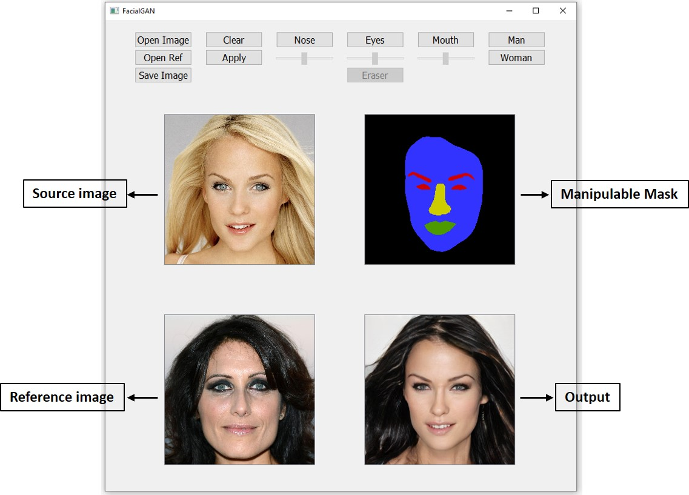

# FacialGAN - Official PyTorch Implementation

<p align="left"></p>

Clone this repository:
```bash
git clone https://github.com/facialGAN/facialGAN
```

## ToolBox for attribute manipulation

We have developed an interactive facial toolbox that allows an easy manipulation of both styles and attributes.  The user only needs to select the source image and the reference that wants to apply.  Then, our model will produce the desired combination. On top of that, the user also can alter the default mask and the effects will be displayed on the output.

<h3>Video tutorial -> https://www.youtube.com/watch?v=N4jRSNKPB0s &#x1F3AC; &#x1F3AC;</h3>

<p align="left"></p>

```bash
cd FacialGAN/Toolbox
mkdir checkpoints
```
Download [Pretrained Model (facial_checkpoint.ckpt)](https://osf.io/jreq5/?view_only=e05906fa10cb4b8b8f22a82501205d12) and save it in checkpoints folder.


Create enviroment with the dependencies:

On Windows 10:

```bash
conda env create -f facialGAN_env_windows.yml
conda activate facialGAN
```

On 19.04 Ubuntu:

```bash
conda env create -f facialGAN_env_ubuntu.yml
conda activate facialGAN
```

Run toolbox:
```bash 
python demo.py 
```

## Training Code
```bash
cd FacialGAN/Training
mkdir data
```
Download CelebA-HQ
```bash
bash download.sh celeba-hq-dataset
```
Download [CelebAMask-HQ](https://drive.google.com/file/d/1badu11NqxGf6qM3PTTooQDJvQbejgbTv/view) and save it in data folder.

Download [Pretrained Segemtation Model (weights_seg.pth)](https://osf.io/jreq5/?view_only=e05906fa10cb4b8b8f22a82501205d12) and save it in core folder.

```bash
bash train.sh
```

## Acknowledgement
We acknowledge the official code [StarGANv2](https://github.com/clovaai/stargan-v2) & [MaskGAN](https://github.com/switchablenorms/CelebAMask-HQ)

## Citation
```
@misc{durall2021facialgan,
      title={FacialGAN: Style Transfer and Attribute Manipulation on Synthetic Faces}, 
      author={Ricard Durall and Jireh Jam and Dominik Strassel and Moi Hoon Yap and Janis Keuper},
      year={2021},
      eprint={2110.09425},
      archivePrefix={arXiv},
      primaryClass={cs.CV}
}
```
